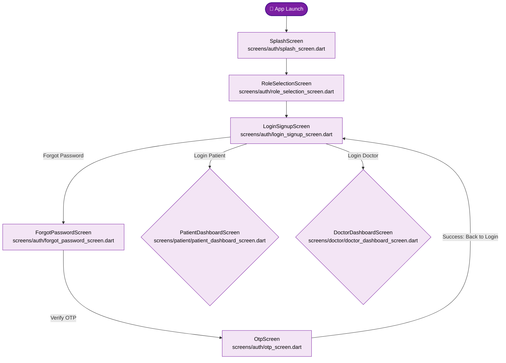
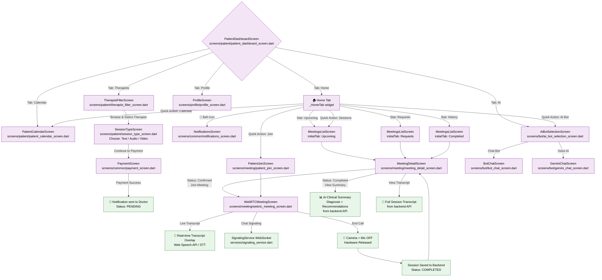
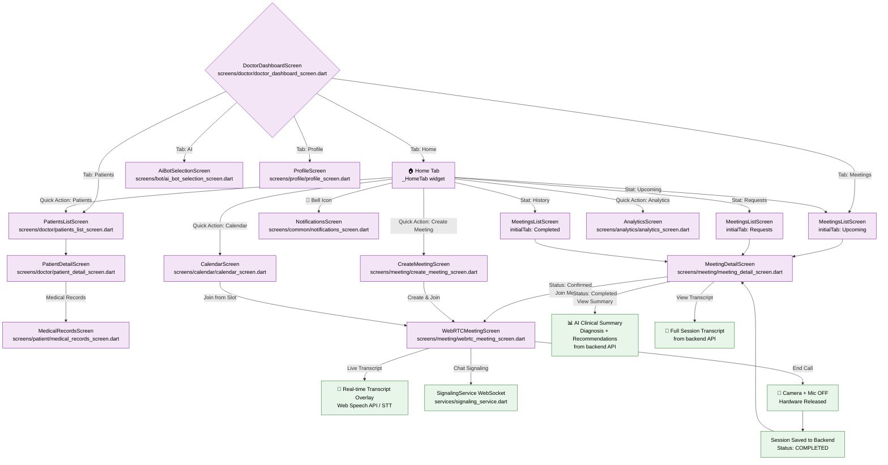
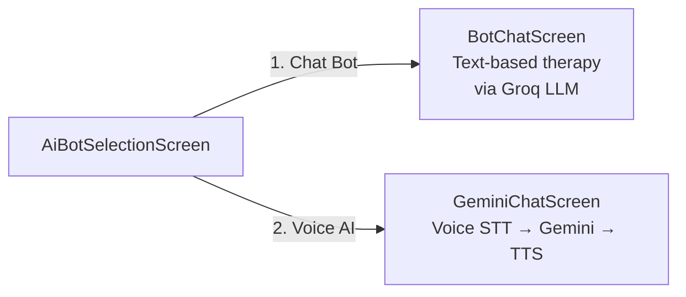

# PurpleTech — Application Workflow

> This document maps the **exact** navigation flow as implemented in the Flutter code for both Patient and Doctor sides.

---

## 🟣 Common Authentication Workflow

---

## 🟣 Patient Complete Workflow

---

## 🩺 Doctor Complete Workflow

---

## 🤖 AI Bot Sub-Flow

---

## 📡 Backend Connections (Shared Services)

| Feature | API Call | Backend Endpoint |
|---------|----------|-----------------|
| Login | `ApiService().login()` | `POST /api/v1/auth/login` |
| Register | `ApiService().register()` | `POST /api/v1/auth/register` |
| Verification | `ApiService().submitTherapistVerification()` | `POST /api/v1/therapist/submit-verification` |
| Browse Therapists | `ApiService().getDoctors()` | `GET /api/v1/doctors` |
| Book Appointment | `ApiService().createAppointment()` | `POST /api/v1/appointments` |
| My Sessions | `ApiService().getPatientAppointments()` | `GET /api/v1/appointments/patient/{id}` |
| Doctor Sessions | `ApiService().getDoctorAppointments()` | `GET /api/v1/appointments/doctor/{id}` |
| Session Summary | `ApiService().getSessionSummary()` | `POST /api/v1/ai/session-summary` |
| Session Transcript | `ApiService().getSessionTranscript()` | `GET /api/v1/transcript/{id}` |
| WebRTC Signaling | `SignalingService.connect()` | `WS /api/v1/webrtc/ws/{id}/{role}` |