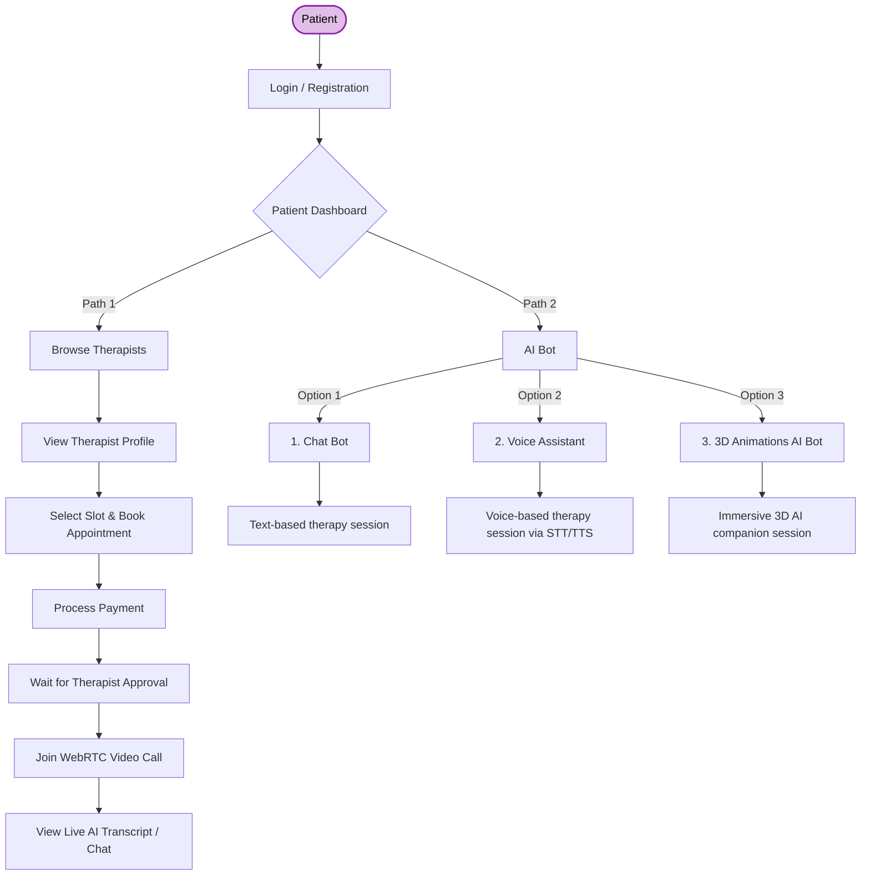
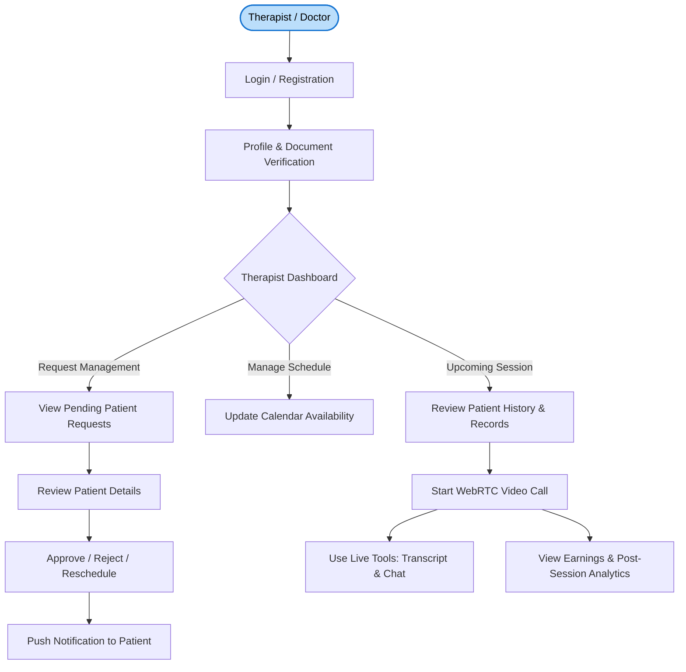
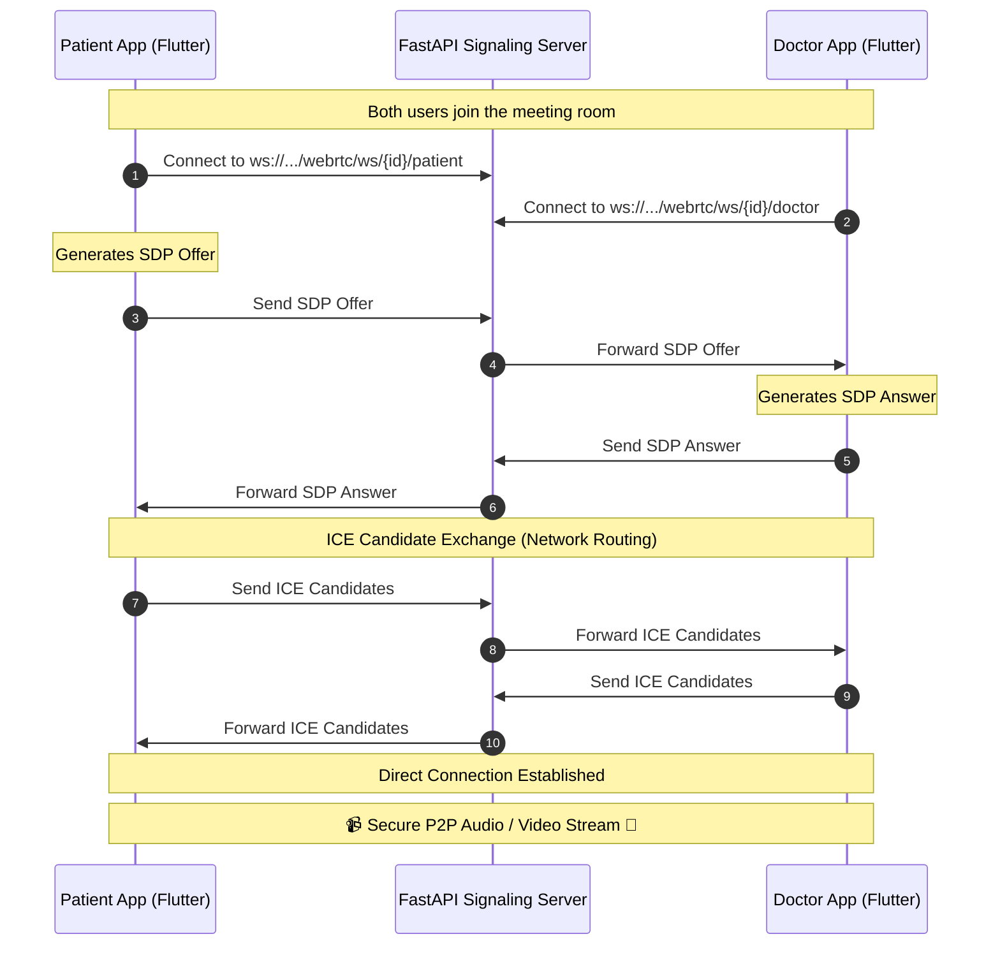
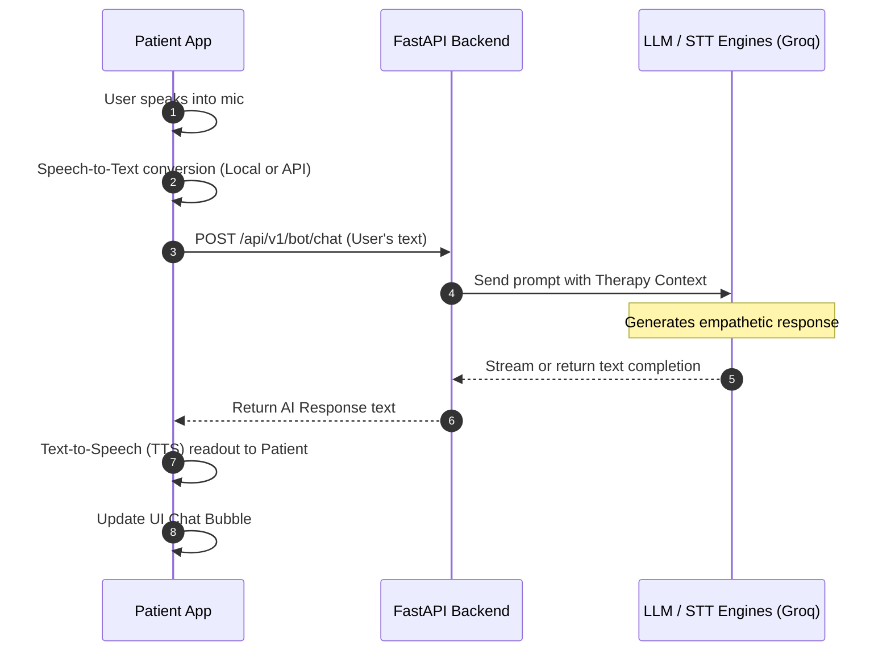
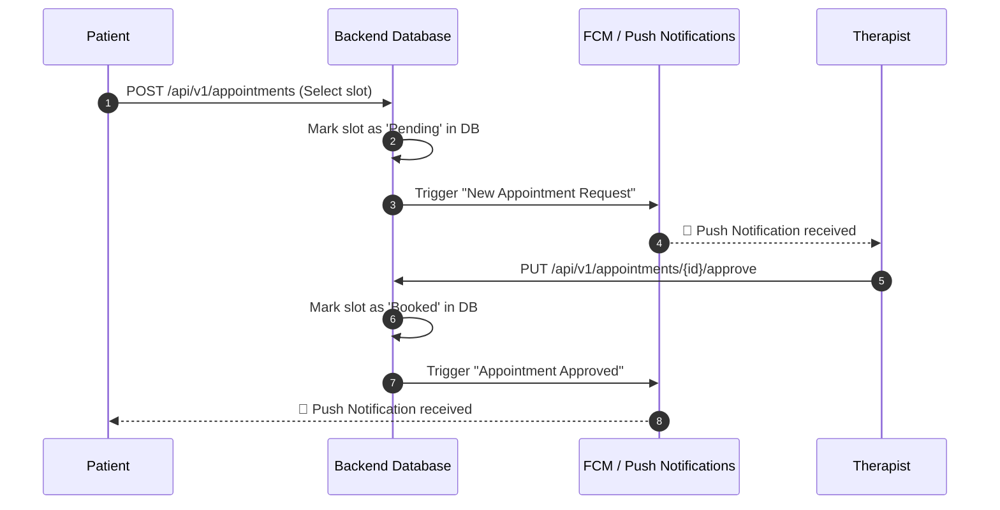

# Purple Tech - Role and Feature Workflows

Below are the visual workflows for the Purple Tech platform, broken down by **User Roles** (Patient vs. Therapist) and by **Core Features**.

## 1. Role-Wise Workflows

### A. Patient Workflow
This diagram represents the typical journey of a Patient from onboarding to completing a therapy session.

### B. Doctor / Therapist Workflow
This diagram represents the journey of a Therapist managing their schedule and conducting sessions.

---

## 2. Feature-Wise Workflows

### A. Telemedicine Video Session (WebRTC Signaling)
This sequence diagram shows how the FastAPI backend facilitates the connection between a Patient and a Doctor so they can stream video directly to each other.

### B. AI Bot Interaction Flow
This sequence shows the workflow when a patient decides to interact with the AI Bot instead of a human therapist.

### C. Appointment Booking & Notification Flow
How a booking is made and the therapist is notified.

